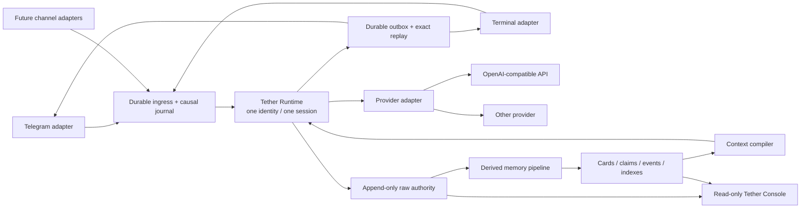

# Tether Architecture

中文文档见 [ARCHITECTURE.zh-CN.md](ARCHITECTURE.zh-CN.md).

## Design goal

Tether keeps one persona-bearing agent attached to one authoritative session while channels, providers, processes, and derived memory layers can change around it. The architecture follows the [Selfsame Protocol](SELFSAME_PROTOCOL.md): identity continuity is a data and recovery invariant, not a similarity claim about model output.

The diagram below is the complete architecture target. The first public snapshot implements the runnable continuity core, append-only repository, semantic and durable primitives, terminal plus live Telegram long-poll channels in one process, provider boundary, synthetic probes, and read-only Console. Automatic fold/card/semantic extraction and production process supervision remain separate generalization milestones; see the status section in [README.md](README.md).

## System boundaries

## Identity plane

The runtime owns the authoritative identity and session. Adapters attach; they do not create independent persona histories. A provider conversation ID, process ID, socket, terminal, Telegram chat, and frontend tab are routing facts—not identity proof.

Before attaching any channel or allowing persona-bearing inference, the reference CLI acquires a single-instance lock for the configured storage root and calls `session.open` exactly once. An existing anchor must resume and pass its memory proof. On a genuinely empty data root, explicit `allowInitialSessionCreate` authority may create the first anchor at this process boundary, so no channel races to own bootstrap and Telegram may be the first input.

If the anchor is absent while any raw transcript, derived summaries or cards, or causal-journal authority remains, creation is refused. If resume cannot be proven, inference is blocked. A healthy provider response is not accepted as a substitute for the missing session, and a second runtime cannot concurrently write the same storage root.

## Causal transport plane

Ingress receives a stable causal event ID before inference. The journal distinguishes:

1. accepted input;
2. inference in progress;
3. committed output;
4. delivery attempt;
5. delivery acknowledgement;
6. blocked or dead-letter state.

This separation allows a lost delivery acknowledgement to retry transport without repeating inference. Duplicate ingress resolves to the same committed bytes through exact replay.

Ordering is scoped to the relevant conversation lane while all accepted turns still join the one authoritative history. Backpressure and provider-capacity failures must not consume attempts as if they were permanent message defects.

## Memory plane

### Raw authority

The raw transcript and source assets are append-only evidence. They survive compaction and can reconstruct derived layers. Source assets are referenced by stable content identity rather than mutable display names.

### Active context and compaction

Active context is bounded for the model window. Compaction produces a derived replacement with source boundaries and validation state. It never deletes the raw transcript. A failed fold leaves the last valid active context in place.

### Derived memory

Cards, claims, events, projections, vectors, manifests, and indexes are useful but non-authoritative. Each item links to raw evidence and applicable human corrections. Administrative indexes should rebuild deterministically; probabilistic derivations preserve model and transformation provenance.

The reference context compiler bounds raw messages, summaries, and cards independently. It includes only the latest configured number of summaries and the latest version of each logical day/week card, then applies the configured card bound. Selected cards enter inference as system context; superseded card versions remain inspectable in append-only storage but are not injected.

### Correction

An authorized correction is appended. Corrected views prefer the latest valid correction while keeping both original evidence and earlier interpretations inspectable. Payloads cannot grant themselves human authority.

## Capability and disclosure plane

Channels can have different tool, write, approval, and output-disclosure rules. Those rules surround a shared identity context; they do not fork memory to manufacture safety. Recipient-aware egress prevents disclosure without creating a second persona that later diverges.

## Console

Tether Console is a read-only projection over configured local memory roots. It provides inspection, coverage, provenance, correction, and queue views without owning or mutating authoritative data. It binds to loopback by default.

## Replaceable adapters

- **Channel adapter:** authenticates ingress, maps delivery metadata, and formats output.
- **Provider adapter:** sends inference requests and normalizes streaming, usage, retry, and error categories.
- **Memory adapter:** persists raw and derived records while satisfying source-lineage and rebuild requirements.
- **Console adapter:** exposes read-only inspection over memory roots.

An adapter is conforming only if its failure behavior preserves the identity and causal invariants; matching a function signature is not enough.

## Recovery invariants

Every change that touches persistence or recovery should prove these counterfactuals with synthetic tests:

- What happens if the process dies after accepting input but before inference?
- What happens after committing output but before delivery acknowledgement?
- What happens if session resume fails while the provider is healthy?
- What happens if compaction produces invalid output?
- What happens if an index or vector store is deleted?
- What happens if two aliases refer to different entities?
- What happens when one channel is read-only and another can write?

The safe outcome may be blocked or delayed. It must not be silent amnesia, duplicate inference, rewritten evidence, or a replacement identity.
