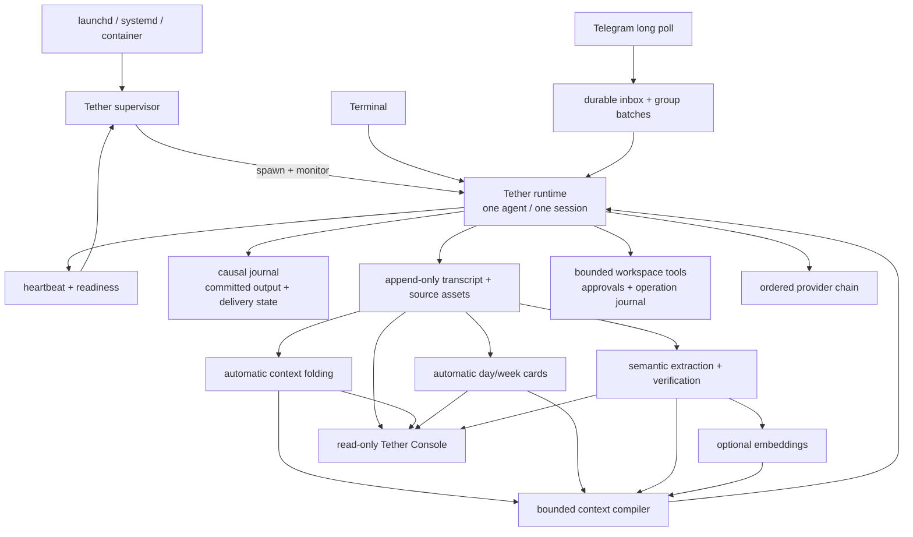

# Tether Architecture

中文文档见 [ARCHITECTURE.zh-CN.md](ARCHITECTURE.zh-CN.md).

## Design goal

Tether keeps one persona-bearing agent attached to one authoritative session while channels, providers, processes, and derived memory layers change around it. Identity continuity is a persistence and recovery invariant, not a claim that two model outputs sound similar. The normative requirements live in the [Selfsame Protocol](SELFSAME_PROTOCOL.md).

The diagram below describes the implementation in this repository.

## 1. Identity plane

`storage.root/session.json` is the authoritative session anchor and is bound to `agent.id`. Startup proceeds in this order:

1. acquire `storage.root/.tether-instance.lock`;
2. verify or initialize the storage schema marker;
3. open the session exactly once;
4. resume the stored anchor and verify its transcript proof, or—only on a genuinely empty root—perform explicitly authorized initial creation;
5. attach terminal and optional Telegram channels;
6. publish readiness.

A provider conversation ID, process ID, Telegram chat ID, terminal, or browser tab is routing state, not identity proof. If the anchor is missing beside raw, derived, delivery, tool, or causal authority, Tether refuses silent creation. If resume proof fails, inference remains blocked. A second runtime cannot concurrently own the same storage root.

The storage marker records a schema version and agent binding. Unknown newer versions, corrupt markers, and an agent mismatch are fail-closed. Existing unversioned roots require an explicit offline migration rather than automatic adoption.

## 2. Causal and delivery plane

Every accepted turn receives a stable causal ID before inference. The causal journal separates:

1. accepted input;
2. inference attempt;
3. committed output;
4. delivery attempt;
5. delivery acknowledgement;
6. retry, operator-pause, or terminal dead-letter state.

The runtime serializes persona turns through one queue, so all channels append to one history in a deterministic order. Telegram adds a durable inbox around that queue. Duplicate updates resolve to the same causal record; a lost delivery acknowledgement reuses the committed response and does not call the model again.

Telegram group messages are durably accumulated into exact batches. The provider returns a bounded JSON reply envelope, which is validated and repaired at most the configured number of times. Exact batch/run records are replayed after a crash. Long outputs are split deterministically below Telegram's limit; only the first chunk carries the reply target. If that target has disappeared, the adapter retries once without reply metadata while preserving the same committed output.

Capacity and transient transport failures back off without turning one update into duplicate inference. Ambiguous inference, tool effects, or delivery are operator-paused rather than guessed. Repeated recoverable failures end in inspectable dead-letter state.

## 3. Memory plane

### Raw authority

`memory/transcript.jsonl` and archived source assets are append-only evidence. A session checkpoint includes a transcript proof. Derived memory never replaces the source authority.

### Active context folding

`ConversationHistory` tracks token and round watermarks. Above the soft watermark it selects an old prefix while retaining a configured minimum raw tail, asks the fold model for a bounded additive summary, validates the candidate, then installs it atomically. Older summary-window entries move to an append-only summary archive.

A failed fold leaves the current rounds intact and enters bounded retry backoff. If the active context crosses the hard escalation boundary after repeated failures, Tether writes a deterministic emergency digest and archives the full removed rounds before reducing the active file. In every path the original conversation remains recoverable.

### Day and week cards

The maintenance loop settles completed operational days according to timezone offset, cutoff, quiet window, and forced-settlement time. It generates source-linked day cards, then week cards only after their day sources are fully covered. Failed or policy-pending cards leave the lower layer available. Card versions and coverage records are append-only; context compilation selects only the latest effective logical version.

### Semantic memory

Each committed turn is idempotently queued for model extraction. The semantic pipeline preserves raw-message attribution, resolves entities and aliases, extracts claims/events/projections, verifies evidence and protected quotations, and routes high-risk or unresolved cases through review state. Model output cannot self-assert human authority.

Modes are cumulative:

- `off`: no semantic queue or semantic injection;
- `shadow`: derive and inspect semantic records without injecting them;
- `cards`: inject verified semantic cards/projections while folds remain ordinary layered folds;
- `full`: also allows a verified semantic fold to become the active fold view.

Manifest journals are bounded and compacted. Deterministic indexes and probabilistic records retain source/provenance links, so the layer can be rebuilt from transcript evidence and corrections.

### Vector recall

When enabled, embeddings index effective cards, supported claims, accepted events, and non-stale accepted projections. Backfill is resumable and size-bounded. At inference time, query-relevant verified memory is added to the same system context. Embedding failure never disables ordinary cards; the runtime logs a category and continues with layered memory.

## 4. Tool and capability plane

The included provider adapter supports a bounded tool-call loop for three local tools:

- `list_workspace_directory`;
- `read_workspace_file`;
- `write_workspace_file` (atomic UTF-8 create/replace).

Every root is identified by a stable root ID and resolved through physical paths. Traversal, symlinks, hidden/credential-like paths, oversize operations, and paths outside a declared root are rejected. A workspace root may neither contain nor be contained by `storage.root`; the model cannot reach session, transcript, inbox, or tool-authority files through its workspace capability.

Policies are selected per channel scope (`terminal`, `telegramPrivate`, `telegramGroup`, `default`) and per capability (`read`, `write`) as `allow`, `approval`, or `deny`. This changes what a turn may do, never which persona history it sees.

Tool intent, approval, and result are durably journaled. Replaying an identical approved operation reuses its record. If the process cannot prove whether an external file mutation completed, it operator-pauses instead of repeating the write.

## 5. Maintenance and supervision plane

`MemoryMaintenanceSupervisor` runs inside the persona runtime. It starts immediately, is triggered after committed turns, drains successful work with a short active delay, idles at the configured interval, and exponentially backs off after failures. One cycle processes semantic work, card settlement, and vector maintenance.

`TetherSupervisor` is a separate parent process. It holds its own lock, spawns the runtime, validates child-parent identity, monitors readiness and heartbeat freshness, restarts unhealthy/exited children with exponential delay and jitter, and stops after a bounded restart budget rather than looping forever. SIGTERM is followed by a configurable grace period before SIGKILL.

A host service manager should run `bin/tether-supervisor.cjs`, not the child runtime directly. The repository provides synthetic launchd and systemd examples.

## 6. Operations and recovery plane

Operational writes acquire both supervisor and runtime locks. Storage migration, memory rebuild/backfill, backup, restore, and dead-letter mutation therefore refuse to race a live runtime or a supervisor waiting to restart one.

Backups:

- copy regular files only and reject symlinks/special files;
- exclude ephemeral locks and health files;
- record SHA-256 for every file and a canonical root digest;
- verify storage version, agent binding, session anchor, and transcript proof;
- restore atomically into an empty or matching resumable target;
- copy `session.json` last and write a durable restore receipt.

Backup directories contain readable sensitive data and are not encryption containers. Workspace roots are intentionally outside continuity storage and need a separate backup policy.

## 7. Console plane

Tether Console is a read-only projection over the configured local memory roots. It displays folds, day/week cards, semantic claims/events/projections/reviews, queue health, embedding coverage, source references, referential integrity, and the latest compile manifest. It does not accept filesystem paths from requests, return absolute host paths, write journals, or silently skip malformed JSONL. The backend binds to loopback by default.

## 8. Replaceable adapters

- **Provider adapter:** normalize inference, tool calls, embeddings, timeout, and failure categories.
- **Channel adapter:** authenticate ingress, assign stable causal IDs, preserve delivery state, and shape recipient-visible output.
- **Memory implementation:** preserve raw authority, source lineage, correction provenance, and rebuildability.
- **Console projection:** inspect without owning or mutating memory.

A matching function signature is insufficient: an adapter conforms only when its failure paths preserve identity, causality, and evidence.

## 9. Counterfactual verification

Every persistence or recovery change should prove at least these synthetic counterfactuals:

- process death before inference, after inference, and before delivery acknowledgement;
- duplicate ingress and a lost Telegram reply target;
- session-resume failure while providers are healthy;
- invalid fold/card/semantic model output;
- deleted vector/index data;
- alias collision and fabricated quotation;
- tool approval replay and ambiguous external mutation;
- concurrent maintenance, backup, or restore attempts;
- stale heartbeat and supervisor crash-loop exhaustion.

A safe result may be delayed or blocked. It must not be silent amnesia, duplicate inference, rewritten evidence, duplicated side effects, or a replacement identity.
