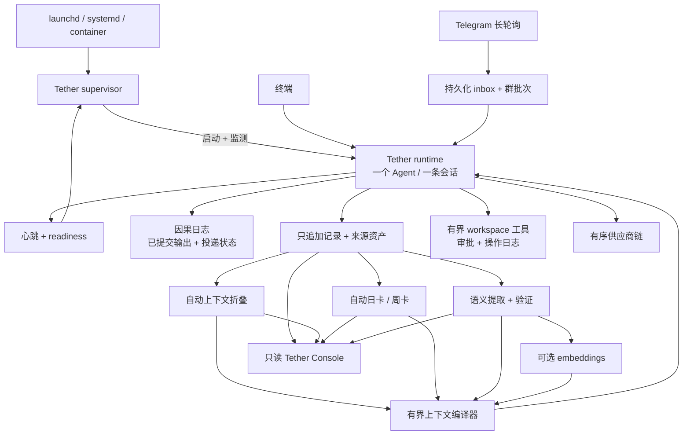

# Tether 架构

English documentation: [ARCHITECTURE.md](ARCHITECTURE.md).

## 设计目标

Tether 让一个承载人格的 Agent 始终连在同一条权威会话上，而通道、供应商、进程和派生记忆层都可以在它周围变化。身份连续性是持久化与恢复层面的不变量，不是“两段模型输出听起来很像”这种主张。规范性要求写在 [Selfsame Protocol](SELFSAME_PROTOCOL.md) 中。

下图描述的就是当前仓库已经实现的架构。

## 1. 身份平面

`storage.root/session.json` 是权威会话锚点，并与 `agent.id` 绑定。启动顺序固定为：

1. 取得 `storage.root/.tether-instance.lock`；
2. 校验或初始化存储版本标记；
3. 恰好一次地打开会话；
4. 恢复既有锚点并校验 transcript proof；只有目录真正为空时，才允许显式授权的首次创建；
5. 接入终端与可选的 Telegram；
6. 发布 readiness。

供应商会话 ID、进程 ID、Telegram chat ID、终端或浏览器标签页都只是路由状态，不是身份证明。如果锚点旁边已经存在任何原始、派生、投递、工具或因果权威，Tether 就拒绝无声创建；恢复证明失败时，推理保持阻断。第二个 runtime 也不能同时占有同一个存储根。

存储标记记录 schema 版本和 Agent 绑定。未知的新版本、损坏的标记和 Agent 不匹配都 fail-closed。既有的无版本目录必须显式离线迁移，不会被运行时自动“认领”。

## 2. 因果与投递平面

每一轮被接受的输入在推理前就取得稳定的因果 ID。因果日志把以下阶段分开记录：

1. 输入已接受；
2. 推理尝试；
3. 输出已提交；
4. 投递尝试；
5. 投递确认；
6. 重试、人工暂停或最终死信。

运行时用一条队列串行处理全部人格轮次，因此所有通道以确定顺序汇入同一份历史。Telegram 在这条队列外再包一层 durable inbox。重复 update 会落到同一条因果记录；投递确认丢失时复用已提交响应，不会再问一次模型。

Telegram 群消息先持久化，再组成精确批次。供应商返回有界 JSON 回复信封；系统验证它，并最多按配置次数修复。崩溃后重放的是原批次/原 run。长回复按 Telegram 上限确定性切片，只有第一片携带 reply target；目标已被删除时，去掉 reply metadata 裸发一次，正文仍是同一份已提交输出。

容量与瞬时传输故障会退避，不会把一条 update 变成重复推理。无法确认的推理、工具副作用或投递进入 operator-paused，而不是靠猜。可恢复故障超过次数后进入可检查的 dead-letter。

## 3. 记忆平面

### 原始权威

`memory/transcript.jsonl` 与归档的来源资产是只追加证据。会话 checkpoint 带 transcript proof。任何派生记忆都不能取代来源权威。

### 活跃上下文自动折叠

`ConversationHistory` 同时跟踪 token 与轮次数水位。超过软水位后，它选取较旧前缀、保留配置好的最小原文尾部，请 fold 模型生成有界的增量摘要；候选通过验证后才原子生效。滑出活跃摘要窗口的旧摘要会进入只追加归档。

折叠失败时，当前轮次原样保留，并进入有界退避。如果多次失败后活跃上下文越过硬升级边界，Tether 会先归档即将移出的完整原文，再写入确定性紧急速记，随后才缩小活跃文件。无论走哪条路径，原始对话都可以恢复。

### 日卡与周卡

维护循环按时区偏移、换日小时、静默窗口和强制结算时间判断一个“运行日”是否结束。它先生成带来源链接的日卡；只有一周内的来源都被日卡覆盖后，才生成周卡。生成失败或策略仍为 pending 时，较低层来源继续可用。卡片版本和 coverage 只追加；编译上下文时只选每个逻辑周期的最新有效版本。

### 语义记忆

每一轮提交后都会幂等地进入模型提取队列。语义管线保留原始消息归属，解析实体与别名，提取断言、事件与投影，验证证据与受保护引语，并把高风险或无法定论的结果送入复核状态。模型输出不能自称“human verified”。

四种模式逐级增加能力：

- `off`：不启用语义队列，也不注入语义层；
- `shadow`：可派生、可在 Console 检查，但不注入上下文；
- `cards`：向上下文注入已验证的语义卡片/投影，活跃折叠仍使用普通分层折叠；
- `full`：在此基础上，也允许通过验证的语义 fold 成为活跃折叠视图。

manifest 日志有大小与条数上限，会自动 compact。确定性索引和概率性记录都保留来源/模型出处，因此可以从 transcript 证据与订正重建。

### 向量召回

启用后，embedding 会索引有效卡片、受支持断言、已接受事件和未过期投影。回填可续跑且有大小边界。推理时，和当前问题相关的已验证记忆会加入同一份 system context。embedding 失败不会拖垮普通卡片：运行时只记录故障类别，然后继续使用分层记忆。

## 4. 工具与能力平面

内置 provider adapter 支持有界 tool-call 循环，并提供三个本地工具：

- `list_workspace_directory`；
- `read_workspace_file`；
- `write_workspace_file`（原子的 UTF-8 创建/替换）。

每个根目录都有稳定 root ID，并按物理路径解析。路径穿越、符号链接、隐藏/疑似凭据路径、超限操作与根目录外路径都会被拒绝。workspace 根不能包含 `storage.root`，也不能被它包含；模型不可能借 workspace 能力碰到 session、transcript、inbox 或工具权威文件。

策略按通道域（`terminal`、`telegramPrivate`、`telegramGroup`、`default`）与能力（`read`、`write`）选择 `allow`、`approval` 或 `deny`。变化的是这一轮能做什么，绝不是这一轮能看到哪一份人格历史。

工具意图、审批与结果都持久化。重放完全相同、已经批准的操作时会复用记录。如果进程无法证明一次外部文件写入是否完成，就进入 operator-paused，不会冒险再写一次。

## 5. 维护与进程监督平面

`MemoryMaintenanceSupervisor` 运行在人格进程内部：启动后立即执行，提交对话后被唤醒，有工作时按短延迟继续，无工作时按普通周期休眠，失败时指数退避。每一轮依次处理语义工作、卡片结算和向量维护。

`TetherSupervisor` 是独立父进程。它持有自己的锁，启动 runtime，校验父子身份，监测 readiness 与心跳新鲜度；子进程退出或失去健康时，按指数延迟 + jitter 重启；超出时间窗内的重启预算后直接停住，而不是无限 crash loop。SIGTERM 后会留出可配置的优雅退出时间，再按需 SIGKILL。

宿主机的 service manager 应运行 `bin/tether-supervisor.cjs`，而不是直接运行子 runtime。仓库提供合成的 launchd 与 systemd 示例。

## 6. 运维与恢复平面

离线写操作会同时取得 supervisor lock 和 runtime lock。存储迁移、记忆重建/向量回填、备份、恢复和死信状态修改，都拒绝与一个活着的 runtime 或正准备重启它的 supervisor 竞争。

备份流程会：

- 只复制普通文件，拒绝符号链接与特殊文件；
- 排除临时锁和健康文件；
- 为每个文件记录 SHA-256，并计算规范化根摘要；
- 验证存储版本、Agent 绑定、会话锚点与 transcript proof；
- 只恢复到空目录或带同一份可续跑 receipt 的目标；
- 原子复制，最后才放入 `session.json`，并写持久化恢复收据。

备份目录里是可直接读取的敏感数据，**不是加密容器**。workspace 根刻意位于连续性存储之外，需要独立备份。

## 7. Console 平面

Tether Console 是对本地记忆根的只读投影。它展示 fold、日/周卡、语义断言/事件/投影/复核、队列健康、向量覆盖、来源引用、参照完整性与最近一次 compile manifest。它不接受请求传入文件路径，不返回宿主机绝对路径，不写日志，也不会悄悄跳过损坏的 JSONL。后端默认只绑定 loopback。

## 8. 可替换适配器

- **Provider adapter：** 规范化推理、工具调用、embedding、超时和故障类别。
- **Channel adapter：** 认证入站、分配稳定因果 ID、保留投递状态，并塑造接收方可见输出。
- **Memory implementation：** 保留原始权威、来源血缘、订正出处和可重建性。
- **Console projection：** 只检查，不拥有也不修改记忆。

函数签名对得上还不够；只有失败路径也保持身份、因果和证据不变量，适配器才算合规。

## 9. 反事实验证

每一处持久化或恢复改动，至少要用合成测试证明这些反事实：

- 推理前、推理后、投递确认前分别崩溃会怎样；
- 重复入站和 Telegram reply target 消失会怎样；
- 供应商健康但 session resume 失败会怎样；
- fold/card/semantic 模型返回无效内容会怎样；
- 向量或索引被删会怎样；
- 别名撞车、虚构引语会怎样；
- 工具审批重放与外部写入状态不明会怎样；
- 维护、备份或恢复并发启动会怎样；
- 心跳过期与 supervisor 重启预算耗尽会怎样。

安全结果可以延迟，也可以阻断；它不能是无声失忆、重复推理、改写证据、重复副作用或替代身份。
