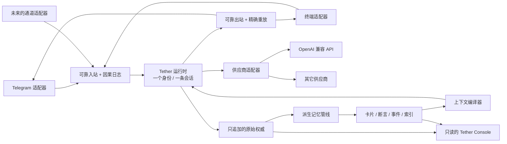

# Tether 架构

English documentation: [ARCHITECTURE.md](ARCHITECTURE.md).

## 设计目标

Tether 让一个承载人格的 agent 始终连在同一条权威会话上，而通道、供应商、进程和派生记忆层都可以在它周围变化。整套架构遵循 [Selfsame Protocol](SELFSAME_PROTOCOL.md)：**身份连续性是数据与恢复层面的不变量，不是"模型输出看起来很像"这种相似性主张。**

下面这张图是完整的架构目标。第一份公开快照实现的是：可运行的连续性内核、只追加的仓库、语义与可靠投递原语、同进程内的终端 + 实时 Telegram 长轮询通道、供应商边界、合成探针，以及只读 Console。自动折叠/卡片/语义抽取和生产级进程守护，仍是各自独立的通用化里程碑；见 [README.zh-CN.md](README.zh-CN.md) 里的状态一节。

## 系统边界

## 身份平面

运行时持有权威身份与会话。适配器只是**接入**，它们不会创建各自独立的人格历史。供应商的会话 ID、进程 ID、socket、终端、Telegram 聊天、前端标签页——这些都是路由事实，**不是身份证明**。

在接入任何通道、或允许任何承载人格的推理之前，参考 CLI 会为配置好的存储根目录取得一把单实例锁，并**恰好调用一次** `session.open`。已存在的锚点必须恢复成功，并通过它的记忆证明。只有在数据根目录真的为空时，显式的 `allowInitialSessionCreate` 授权才可以在这个进程边界上创建第一个锚点——这样就不会有哪个通道去争抢引导权，Telegram 也可以成为第一条输入。

如果锚点不在了，而任何原始记录、派生摘要或卡片、因果日志权威还在，创建会被拒绝。如果恢复无法被证明，推理会被阻断。**一个健康的供应商响应，不能拿来替代那条缺失的会话**；第二个运行时也不能并发写入同一个存储根目录。

## 因果传输平面

入站在推理之前就会拿到一个稳定的因果事件 ID。日志区分这几种状态：

1. 已接受的输入；
2. 推理进行中；
3. 已提交的输出；
4. 投递尝试；
5. 投递确认；
6. 阻塞或死信状态。

正因为分开了，投递确认丢失时才可以只重试传输，而不重复推理。重复入站会通过精确重放解析到**同一份已提交的字节**。

顺序保证的范围是相关的那条会话轨道，同时所有被接受的轮次仍然汇入那一条权威历史。背压与供应商容量故障，绝不能被当成消息本身的永久性缺陷来消耗重试次数。

## 记忆平面

### 原始权威

原始记录与来源资产是只追加的证据。它们在压缩之后依然存在，并且能重建派生层。来源资产靠稳定的内容身份来引用，而不是靠可变的显示名。

### 活跃上下文与压缩

活跃上下文对模型窗口是有界的。压缩产出一份带来源边界和校验状态的派生替代物，**它永远不删除原始记录**。折叠失败时，上一份有效的活跃上下文原样留在那里。

### 派生记忆

卡片、断言、事件、投影、向量、manifest 与索引都很有用，但都**不是权威**。每一项都链接回原始证据和适用的人工订正。管理性索引应当能确定性地重建；概率性的派生结果要保留模型与变换的出处。

参考实现里的上下文编译器分别限制原始消息、摘要和卡片三者的量。它只纳入配置数量内的最新摘要，以及每个逻辑日卡/周卡的最新版本，然后再套用卡片的配额上限。被选中的卡片以 system 上下文进入推理；被取代的旧版本仍然留在只追加的存储里可供查阅，但不会被注入。

### 订正

获得授权的订正以追加方式写入。订正后的视图优先采用最新的有效订正，同时让原始证据与更早的解读都保持可查。**载荷本身无法授予自己人类权限。**

## 能力与披露平面

不同通道可以有不同的工具、写入、审批和输出披露规则。这些规则环绕在一份**共享的**身份上下文之外；它们不会为了制造安全感而把记忆分叉。按接收方区分的出站控制可以防止不该有的披露，而不必造出第二个人格——那个人格迟早会分道扬镳。

## Console

Tether Console 是对已配置本地记忆根目录的只读投影。它提供检视、覆盖、出处、订正与队列视图，不拥有也不修改权威数据。默认绑定 loopback。

## 可替换的适配器

- **通道适配器：** 认证入站、映射投递元数据、格式化输出。
- **供应商适配器：** 发送推理请求，并把流式、用量、重试与错误类别规范化。
- **记忆适配器：** 持久化原始与派生记录，同时满足来源血缘与可重建的要求。
- **Console 适配器：** 暴露对记忆根目录的只读检视。

一个适配器只有在**它的失败行为也保持了身份与因果不变量**时才算合规——函数签名对得上是不够的。

## 恢复不变量

每一处触及持久化或恢复的改动，都应当用合成测试证明下面这些反事实：

- 进程在接受输入之后、推理之前死掉，会怎样？
- 在提交输出之后、投递确认之前死掉，会怎样？
- 供应商健康、但会话恢复失败，会怎样？
- 压缩产出了无效结果，会怎样？
- 索引或向量库被删了，会怎样？
- 两个别名指向不同实体，会怎样？
- 一个通道只读、另一个可写，会怎样？

安全的结果可以是被阻塞、可以是被延迟。但它**绝不能**是无声的失忆、重复的推理、被改写的证据，或者一个替代身份。
