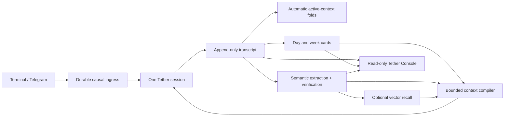
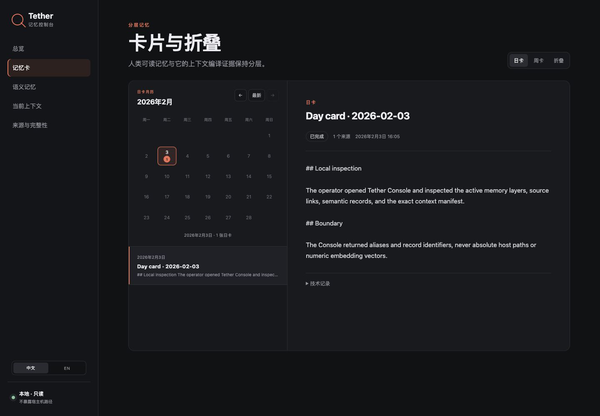

# Tether

Tether is a local-first agent runtime that preserves one continuous identity across channels, provider changes, crashes, and context limits.

<p align="center">
  
</p>

**One agent. One session. Every channel. Memory that stays.**<br>
**一个 Agent，一条连续会话，跨越所有通道，记忆始终留存。**

Terminal and Telegram are two doors into one authoritative session, not two bots with histories that slowly drift apart. Provider failover, process restarts, context folding, and derived memory all happen around that same identity boundary.

[简体中文](README.zh-CN.md) · [Getting started](docs/GETTING_STARTED.md) · [Architecture](ARCHITECTURE.md) · [Selfsame Protocol](SELFSAME_PROTOCOL.md)

Tether was extracted from a production runtime and released as a synthetic, provider-neutral codebase. The repository contains no production conversation, credential, account identifier, or deployment address.

## What ships today

The current tree is the complete reference runtime for the scope below—not a bridge skeleton and not a UI mockup.

| Layer | Included behavior |
|---|---|
| Identity | One fail-closed session anchor; a missing or unprovable anchor never becomes a silent fresh persona |
| Channels | Terminal plus live Telegram private chat, allowlisted groups, mention/all modes, batching, replies, reactions, images, and file previews |
| Delivery | Durable ingress, stable causal IDs, ordered replay, exact committed-output redelivery, retry/backoff, operator pause, and dead-letter inventory |
| Active memory | Append-only raw transcript, token-driven automatic folding, bounded active context, archived summaries, and loss-preserving fallback |
| Long-term memory | Automatic day cards and week cards with configurable operational-day policy and source coverage |
| Semantic memory | Model extraction and verification for claims, events, projections, evidence, reviews, and high-risk paths; `off`, `shadow`, `cards`, and `full` modes |
| Retrieval | Optional embeddings, resumable vector backfill, bounded semantic recall, and graceful fallback to layered cards |
| Tools | Provider tool-call loop with bounded local `list_workspace_directory`, `read_workspace_file`, and atomic `write_workspace_file`; per-channel allow/approval/deny policy |
| Operations | Heartbeats, readiness, supervised restart with jitter and crash-loop budget, storage versioning, migration, backup/verification/restore, and dead-letter CLI |
| Console | A real read-only web frontend and local API for cards, folds, semantic records, queues, vectors, provenance, integrity, and compiled-context manifests |

Any API that implements the documented OpenAI-compatible Chat Completions/Embeddings subset can be configured directly. Other APIs can be connected through the provider adapter boundary without changing the session or memory model.

## The invariant

Most bridges ask whether a message was delivered. Tether also asks what happens when the system restarts, the provider times out, the reply target disappears, the model window fills, or a memory extractor invents a quotation.

Tether fails closed instead of manufacturing continuity:

- resume failure blocks inference rather than creating a replacement session;
- compaction failure retains the last valid active context and the append-only source;
- retry sends the already committed response instead of asking the model again;
- a derived memory cannot become a quotation without matching evidence;
- aliases do not merge identities, and protected quotations or naming events are not mechanically rewritten;
- human correction appends provenance instead of erasing the record;
- tools may have different permissions by channel, but they never receive a forked persona history.

These requirements are specified independently in the [Selfsame Protocol](SELFSAME_PROTOCOL.md) ([Chinese reference translation](SELFSAME_PROTOCOL.zh-CN.md); the English text governs). Tether is a reference implementation; other runtimes can implement the protocol.

## How memory stays



Raw history remains evidence. Folds, cards, claims, events, projections, vectors, indexes, and manifests are derived and rebuildable. The maintenance loop starts with the runtime, runs immediately, wakes after a committed turn, drains work with bounded delays, and backs off after failures.

## Quick start

Requirements: Node.js 20+. Python 3.11+ and pnpm 9+ are needed only for developing or running the Console from source.

```bash
cp config.example.json config.json
cp persona-policy.example.md persona-policy.private.md

# Edit config.json. Keep storage.root and tools.workspaceRoots separate,
# outside this source checkout. Then inject credentials through the shell.
export PRIMARY_API_KEY='set-locally'

make check
node bin/tether-supervisor.cjs ./config.json
```

For foreground development without automatic restart:

```bash
node bin/tether.cjs ./config.json
```

Enable Telegram in the same `config.json`, set `owner.telegramUserIds`, keep groups explicitly allowlisted, and export the token named by `telegram.tokenEnv`. Do **not** start a second runtime for Telegram.

Read [Getting started](docs/GETTING_STARTED.md) before connecting real data. Existing unversioned data roots require the explicit offline migration in [Operations and recovery](docs/OPERATIONS.md).

## Tether Console

The Console is not a planned feature: `console/backend/` and `console/frontend/` are both included and tested. It reads the local memory folders without becoming a second database or write authority. The backend binds to `127.0.0.1:8431` by default and returns no absolute host paths.



The screenshot above is the production frontend served by the local backend against the repository's synthetic sample data.

```bash
cd console
python -m venv .venv
. .venv/bin/activate
pip install -r backend/requirements.txt
cd frontend && pnpm install && pnpm build && cd ..
cp .env.example .env
set -a; . ./.env; set +a
PYTHONPATH=backend python -m tether_console
```

The bundled sample data is synthetic and safe for local demonstrations. See [console/README.md](console/README.md).

## Operator commands

```bash
node bin/tether-ops.cjs status ./config.json
node bin/tether-ops.cjs dead-letters ./config.json
node bin/tether-tools.cjs approvals ./config.json

# Offline: stop both supervisor and runtime first.
node bin/tether-memory.cjs status ./config.json
node bin/tether-memory.cjs rebuild-semantic ./config.json
node bin/tether-memory.cjs backfill-vectors ./config.json
node bin/tether-ops.cjs backup /path/outside/storage ./config.json
```

Backups are verified, content-addressed directories; they are not encrypted containers. Workspace roots are deliberately forbidden from containing, or being contained by, `storage.root`, so workspace data needs its own backup policy.

## Deliberate boundaries

- The bundled provider speaks OpenAI-compatible Chat Completions and Embeddings. Other protocols need an adapter.
- The bundled channels are terminal and Telegram. Discord, Matrix, Slack, and others need channel adapters.
- The local tools intentionally have no shell, network, delete, rename, or arbitrary binary-write capability.
- Tether Console is intentionally read-only and loopback-first.
- Tether supplies a child runtime supervisor; launchd/systemd/Docker should start it with a separately bounded host policy when boot management is desired.
- Tether does not provide hosted sync, hosted authentication, telemetry, or a managed cloud service.

These are product boundaries, not unfinished claims about the features listed in the table above.

## Repository layout

```text
runtime/                  Session, memory, tools, operations, channels, providers
bin/                      Runtime, supervisor, memory, tools, and operations CLIs
console/backend/          Read-only local-folder Console API
console/frontend/         Tether Console web interface
examples/                 Synthetic configs and service-manager examples
scripts/                  Offline conformance, export, link, and disclosure guards
docs/                     Setup, configuration, adapters, testing, and recovery
SELFSAME_PROTOCOL.md       Implementation-independent continuity specification
```

## Verification

All default checks are synthetic and require no provider, Telegram token, private history, or network access.

```bash
make check       # runtime, protocol, export, disclosure, Markdown links
make check-all   # plus Console backend/frontend tests and production build
```

See [Testing and conformance](docs/TESTING.md) for the covered failure paths and the limits of a protocol claim.

## Documentation

- [Getting started](docs/GETTING_STARTED.md) / [中文](docs/GETTING_STARTED.zh-CN.md)
- [Configuration](docs/CONFIGURATION.md) / [中文](docs/CONFIGURATION.zh-CN.md)
- [Architecture](ARCHITECTURE.md) / [中文](ARCHITECTURE.zh-CN.md)
- [Operations and recovery](docs/OPERATIONS.md) / [中文](docs/OPERATIONS.zh-CN.md)
- [Adapter contracts](docs/ADAPTERS.md) / [中文](docs/ADAPTERS.zh-CN.md)
- [Privacy](PRIVACY.md) / [中文](PRIVACY.zh-CN.md)
- [Security](SECURITY.md) / [中文](SECURITY.zh-CN.md)

## Project policy

Tether is licensed under [Apache License 2.0](LICENSE), except for separately noted third-party material. Distributions must preserve applicable attribution in [NOTICE](NOTICE) and [THIRD_PARTY_NOTICES.md](THIRD_PARTY_NOTICES.md). Apache-2.0 includes an explicit patent grant; it does not grant permission to imply endorsement by the Tether project.

Contributions follow [CONTRIBUTING.md](CONTRIBUTING.md), security reports follow [SECURITY.md](SECURITY.md), and project-name usage follows [TRADEMARKS.md](TRADEMARKS.md).
