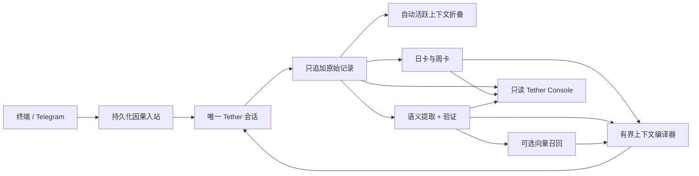

<p align="center">
  
</p>

# Tether

**One agent. One session. Every channel. Memory that stays.**<br>
**一个 Agent，一条连续会话，跨越所有通道，记忆始终留存。**

Tether 是一个 local-first 的人格 Agent 运行时。终端和 Telegram 是通往同一条权威会话的两扇门，不是两个历史慢慢漂开的 bot。供应商回落、进程重启、上下文折叠和派生记忆，都围绕同一个身份边界发生。

[English](README.md) · [快速上手](docs/GETTING_STARTED.zh-CN.md) · [架构](ARCHITECTURE.zh-CN.md) · [Selfsame Protocol](SELFSAME_PROTOCOL.md)（[中文对照](SELFSAME_PROTOCOL.zh-CN.md)）

Tether 从一套生产运行时中抽取而来，公开仓库使用完全合成、与供应商无关的内容，不含任何生产对话、凭据、账号标识或部署地址。

## 现在已经交付了什么

当前源码是下列范围内的完整参考运行时——不是桥的空壳，也不是一张尚未接后端的前端图。

| 层 | 已包含的行为 |
|---|---|
| 身份 | 唯一且 fail-closed 的会话锚点；锚点丢失或无法证明时，绝不会无声创建一个新人格 |
| 通道 | 终端 + 实时 Telegram 私聊；白名单群、mention/all 模式、批处理、回复、reaction、图片与文件预览 |
| 投递 | 持久化入站、稳定因果 ID、顺序重放、已提交响应的原样补发、退避、人工暂停与死信清点 |
| 活跃记忆 | 只追加原始记录、按 token 自动折叠、有界上下文、摘要归档，以及不丢来源的失败降级 |
| 长期记忆 | 按可配置“运行日”策略自动结算日卡、由日卡生成周卡，并记录来源覆盖关系 |
| 语义记忆 | 模型驱动的断言、事件、投影、证据、复核和高风险验证；支持 `off`、`shadow`、`cards`、`full` 四种模式 |
| 语义召回 | 可选 embedding、可续跑的向量回填、有界语义召回；向量失败时自动退回分层卡片 |
| 工具 | 完整的 provider tool-call 循环；有界的本地目录列表、UTF-8 读取和原子写入；按通道 allow/approval/deny |
| 运维 | 心跳与 readiness、带抖动和熔断预算的进程监督、存储版本、迁移、备份/校验/恢复，以及死信 CLI |
| Console | 真正可运行的只读网页前端与本地 API：卡片、折叠、语义记录、队列、向量覆盖、来源、完整性、实际上下文 manifest |

实现了文档所列 OpenAI-compatible Chat Completions / Embeddings 子集的 API 可以直接接入；其它 API 可按 provider adapter 契约接入，不需要改写会话和记忆模型。

## 那根不能断的绳子

普通消息桥只关心“消息发出去了吗”。Tether 还会追问：进程重启怎么办，供应商超时怎么办，引用目标被删怎么办，模型窗口装不下怎么办，记忆提取器把虚构台词记成真人原话又怎么办。

所以它选择 fail-closed，而不是制造一份看起来很像的连续性：

- 会话恢复失败就阻断推理，不创建替代会话；
- 折叠失败就保留上一份有效上下文和只追加来源；
- 投递重试只补发已经提交的响应，不重新问模型；
- 没有匹配来源证据的派生记忆，不能变成引语；
- 别名不会把两个实体并成一个人，引语和命名事件也不会被机械替换；
- 人工订正只追加出处，不擦除历史；
- 不同通道可以有不同工具权限，但拿到的始终是同一条人格历史。

这些要求被独立写在 [Selfsame Protocol](SELFSAME_PROTOCOL.md) 里（[中文对照译本](SELFSAME_PROTOCOL.zh-CN.md)，规范性以英文版为准）。Tether 是参考实现；其它运行时也可以实现这套协议。

## 记忆怎样留下来



原始历史始终是证据。折叠、卡片、断言、事件、投影、向量、索引与 manifest 都是可以重建的派生层。维护循环随运行时启动，启动后立即跑一次，每次对话提交后会被唤醒；有工作时快速继续，出错时有界退避。

## 快速开始

运行时需要 Node.js 20+。只有从源码运行或开发 Console 时，才需要 Python 3.11+ 和 pnpm 9+。

```bash
cp config.example.json config.json
cp persona-policy.example.md persona-policy.private.md

# 编辑 config.json。storage.root 与 tools.workspaceRoots 必须彼此分离，
# 并都放到源码仓库之外。然后从 shell 注入凭据。
export PRIMARY_API_KEY='set-locally'

make check
node bin/tether-supervisor.cjs ./config.json
```

仅用于前台开发、不需要自动重启时：

```bash
node bin/tether.cjs ./config.json
```

在同一份 `config.json` 中启用 Telegram，设置 `owner.telegramUserIds`，群聊保持显式白名单，再导出 `telegram.tokenEnv` 指定的 token。**不要为 Telegram 再启动第二个运行时。**

接入真实数据前请完整阅读[快速上手](docs/GETTING_STARTED.zh-CN.md)。既有的无版本数据目录，必须按[运维与恢复](docs/OPERATIONS.zh-CN.md)执行一次显式离线迁移。

## Tether Console

Console 不是“以后再做”的功能：`console/backend/` 与 `console/frontend/` 都已包含并进入测试。它直接读取本地记忆文件夹，但不会成为第二个数据库或写入权威。后端默认只监听 `127.0.0.1:8431`，响应中也不暴露宿主机绝对路径。


上图是本地后端真正提供的 production frontend，读取的是仓库自带的合成示例数据。

```bash
cd console
python -m venv .venv
. .venv/bin/activate
pip install -r backend/requirements.txt
cd frontend && pnpm install && pnpm build && cd ..
cp .env.example .env
set -a; . ./.env; set +a
PYTHONPATH=backend python -m tether_console
```

仓库自带的演示数据全部是合成内容，可以安全地用于本地展示和截图。详见 [console/README.md](console/README.md)。

## 运维命令

```bash
node bin/tether-ops.cjs status ./config.json
node bin/tether-ops.cjs dead-letters ./config.json
node bin/tether-tools.cjs approvals ./config.json

# 下列命令离线运行：先停 supervisor 和 runtime。
node bin/tether-memory.cjs status ./config.json
node bin/tether-memory.cjs rebuild-semantic ./config.json
node bin/tether-memory.cjs backfill-vectors ./config.json
node bin/tether-ops.cjs backup /path/outside/storage ./config.json
```

备份是经过校验、内容寻址的目录，**不是加密容器**。工具 workspace 被硬性禁止与 `storage.root` 互相包含，因此 workspace 数据要单独制定备份策略。

## 有意保留的边界

- 内置 provider 适配器说的是 OpenAI-compatible Chat Completions / Embeddings；其它协议需要适配器。
- 内置通道是终端和 Telegram；Discord、Matrix、Slack 等需要通道适配器。
- 内置本地工具刻意不提供 shell、网络、删除、重命名和任意二进制写入。
- Tether Console 刻意保持只读、loopback-first。
- Tether 提供负责子运行时的监督器；需要随系统启动时，再让 launchd、systemd 或 Docker 用另一层有界策略启动它。
- Tether 不提供托管同步、托管认证、遥测或云服务。

这些是产品边界，不是上表那些功能“尚未做完”。

## 仓库结构

```text
runtime/                  会话、记忆、工具、运维、通道与供应商
bin/                      runtime、supervisor、memory、tools、ops CLI
console/backend/          只读的本地记忆 Console API
console/frontend/         Tether Console 网页界面
examples/                 合成配置与进程管理示例
scripts/                  离线一致性、导出、链接与泄露检查
docs/                     安装、配置、适配器、测试与恢复文档
SELFSAME_PROTOCOL.md       与具体实现无关的连续性规范
```

## 验证

默认测试全部使用合成数据，不需要供应商、Telegram token、私人历史或网络访问。

```bash
make check       # 运行时、协议、导出、泄露扫描、Markdown 链接
make check-all   # 再加 Console 前后端测试与生产构建
```

具体覆盖的故障路径与协议声明边界，见[测试与一致性](docs/TESTING.md)。

## 文档

- [快速上手](docs/GETTING_STARTED.zh-CN.md) / [English](docs/GETTING_STARTED.md)
- [配置](docs/CONFIGURATION.zh-CN.md) / [English](docs/CONFIGURATION.md)
- [架构](ARCHITECTURE.zh-CN.md) / [English](ARCHITECTURE.md)
- [运维与恢复](docs/OPERATIONS.zh-CN.md) / [English](docs/OPERATIONS.md)
- [适配器契约](docs/ADAPTERS.zh-CN.md) / [English](docs/ADAPTERS.md)
- [隐私](PRIVACY.zh-CN.md) / [English](PRIVACY.md)
- [安全](SECURITY.zh-CN.md) / [English](SECURITY.md)

## 项目政策

Tether 使用 [Apache License 2.0](LICENSE)，另行标注的第三方材料除外。分发时必须保留 [NOTICE](NOTICE) 与 [THIRD_PARTY_NOTICES.md](THIRD_PARTY_NOTICES.md) 中适用的署名。Apache-2.0 含有明确的专利授权，但不允许暗示 Tether 项目对下游产品背书。

贡献方式见 [CONTRIBUTING.md](CONTRIBUTING.md)，安全问题按 [SECURITY.zh-CN.md](SECURITY.zh-CN.md) 私下报告，项目名称与标识规则见 [TRADEMARKS.md](TRADEMARKS.md)。
