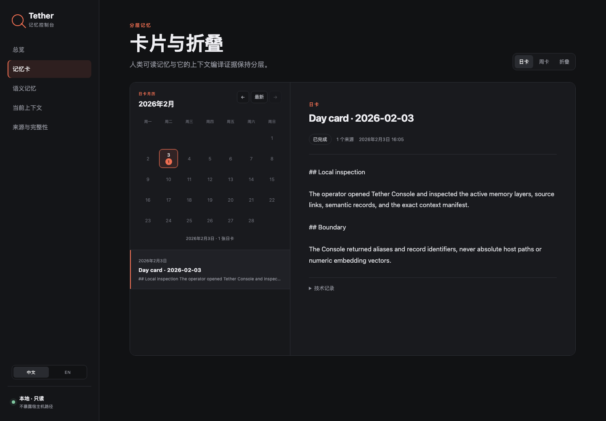
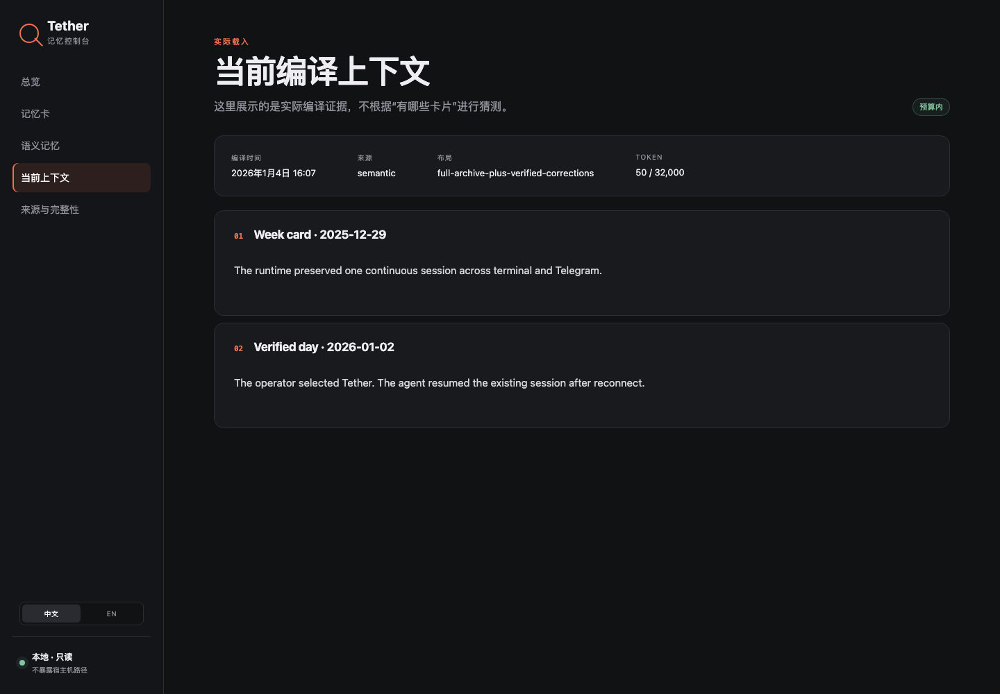
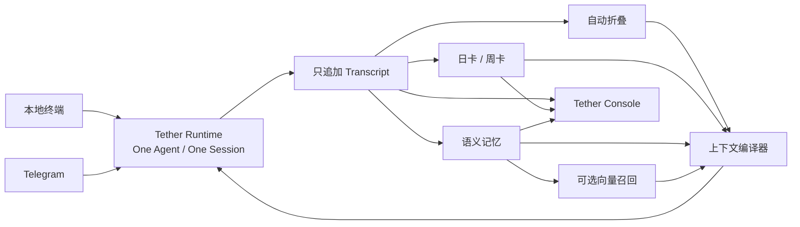
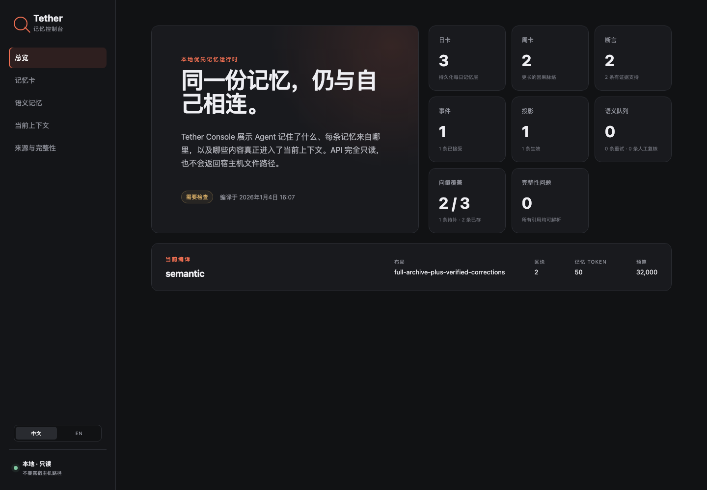

<p align="center">
  
</p>

# Tether

**One agent. One session. Every channel. Memory that stays.**<br>
**一个 Agent，一条连续会话，跨越所有通道，记忆始终留存。**

只要有一个 OpenAI-compatible API，就可以把同一个 Agent 同时接到 Telegram 和电脑本地终端。你在手机上和它聊过的内容，回到电脑终端可以直接接着聊；终端里发生的事情，Telegram 里的它也记得。两个入口共享同一条 session、同一份历史和同一套连续记忆，不是两个定期同步摘要、最终慢慢长成不同人格的 bot。

Tether 这个名字来自宇航员与飞船之间那根不能断的安全绳。通道可以切换，模型供应商可以更换，进程可以重启，上下文也会不断折叠，但 Agent 与它的历史始终连在一起。

[English](README.md) · [快速上手](docs/GETTING_STARTED.zh-CN.md) · [架构说明](ARCHITECTURE.zh-CN.md) · [Selfsame Protocol](SELFSAME_PROTOCOL.zh-CN.md)

Tether 从一套生产运行时中抽取而来，公开仓库使用完全合成、与供应商无关的内容，不含任何生产对话、凭据、账号标识或部署地址。文档中的全部截图与仓库自带的示例数据同样都是合成的。

## 它能做到什么

- ✅ **单会话跨端同步**：本地终端 + Telegram 共用同一条权威会话，实时互通，不是两个独立 bot
- ✅ **专为 API Agent 设计的连续记忆**：自动上下文折叠 + 日卡/周卡叙事总结，保留完整因果脉络，而不是碎片化的相似度召回
- ✅ **人格稳定不漂移**：以人格策略文件（你的 `AGENTS.md`）作为永久锚点，每轮必带，永远不会被历史挤出上下文
- ✅ **可扩展的记忆体系**：原生支持语义提取与校验，可叠加向量召回与自定义记忆库，作为补充而非主干
- ✅ **本地优先**：所有对话、记忆、配置都存在你指定的本地目录，无云端强制依赖、无内置遥测
- ✅ **自带可视化控制台**：本地只读 Web 界面，中英双语，直观查看记忆分层与每轮实际加载的上下文
- ✅ **故障闭锁设计**：崩溃、重启、换模型、接口超时都不会静默生成新人格，连续性优先于可用性

## Tether 是为谁准备的

现在已经有很多 Agent 记忆方案，但它们主要面向两类场景：一类是 Claude Code、Codex 这样的**常驻客户端编码助手**，靠长驻进程维持会话，自带上下文压缩和项目记忆文件；另一类是 mem0、Zep、Letta 这样的**独立记忆组件**，需要你自己搭应用、接通道、做调度才能用起来。

普通 API Agent 面临的是另一类问题。一次 Chat Completions 请求本身没有记忆，每一轮调用都是无状态的：历史上下文、人格设定、长期记忆、通道接入、消息投递和失败恢复，全都要调用方自己负责。常见做法通常是：

1. 每次请求带上最近若干轮对话；
2. 上下文太长以后开一个新 session；
3. 从向量库里召回几条与当前问题相似的记忆；
4. 再加载一份 `AGENTS.md`、`CLAUDE.md` 或 system prompt。

这些方法可以让 Agent「记得一些事实」，却很难保持真正的连续性。向量检索可以找回「用户喜欢秋天」，但不一定能还原「上周三发生了什么、为什么产生矛盾、当时双方说了什么、最后怎样收尾」——叙事具有顺序、因果和未完成状态，而相似度搜索只会返回若干相关碎片。不断加载旧上下文也不是长久方案：上下文不可能无限增长，直接换 session 会切断活跃历史，粗暴摘要又容易丢失人物归属、时间顺序和关键细节。想同时在终端和 Telegram 用，还得维护两套 bot，记忆慢慢分家，最后长成两个不同的 Agent。

**Tether 解决的不是「怎样多存几条记忆」，而是「怎样让一个走 API 的 Agent 仍然拥有连续经历」。**

它适合这些场景：

- 你已经有一个可调用的模型 API，希望把自己的 Agent 直接接入 Telegram；
- 你希望手机 Telegram 和电脑终端访问的是同一个 Agent；
- 你不想从零开发消息桥、上下文折叠、日卡周卡、长期记忆调度和恢复机制；
- 你希望人格、近期对话、长期经历和额外记忆召回共同组成一套完整记忆；
- 你在意进程重启、供应商故障或上下文压缩之后，回来的究竟是不是同一个 Agent。

## Tether 如何形成一套连续的「机格」

Tether 的记忆不只依靠 `AGENTS.md`，但也不能没有 `AGENTS.md`。一套完整的连续人格由几层共同组成，人格锚定骨架，记忆填充经历：

```text
人格锚：AGENTS.md / persona policy   （永久生效，永不折叠）
        ↓
最近原始对话                          （原文保留）
        ↓
自动上下文折叠                        （超过水位自动结算）
        ↓
日卡与周卡                            （长期叙事）
        ↓
可选语义记忆与向量召回                 （补充增强）
        ↓
同一条 Telegram / 终端 session
```

可以把它理解为：

> `AGENTS.md` 告诉 Agent「我是谁」。
> 对话、折叠和日卡周卡告诉 Agent「我们经历过什么」。

### 1. 人格锚：AGENTS.md

使用 Tether 前，你首先需要写一份人格策略文件。它可以直接命名为 `AGENTS.md`（仓库的 `.gitignore` 已默认忽略这个文件名，不会被意外提交），通过配置中的 `persona.policyFile` 加载：

```json
{
  "persona": {
    "policyFile": "./AGENTS.md"
  }
}
```

这份文件相当于 Agent 每一轮都会重新读取的 system prompt，可以包含：Agent 的身份、名字与自我描述；它如何称呼你；语言、语气、回复长度和格式偏好；必须遵守的边界与长期守则；技术原则与项目背景；本地文件和 workspace 的位置说明；以及不应被短期对话覆盖的稳定信息。

人格锚永远不会被自动折叠。无论历史多长，它都会出现在每一轮请求中。但它只负责稳定身份，不能代替经历本身——把所有历史事实塞进一个越来越长的人格文件，既难维护，也保存不了事件顺序、对话来源和变化过程。

### 2. 活跃上下文：保留原文，自动折叠

最近的对话会以原文形式留在活跃上下文中。当上下文超过设定的 token 水位后，Tether 会自动选择较早的一段历史进行折叠，将它转化为连续摘要，同时保留最近若干轮原文。默认配置：

| 配置 | 默认值 | 作用 |
|---|---:|---|
| `activeSoftTokenWatermark` | 36000 | 超过后开始折叠 |
| `activeTargetTokenWatermark` | 24000 | 折叠后的目标水位 |
| `minimumRawTailRounds` | 8 | 始终保留的最近原文轮数 |
| `summaryHistoryLimit` | 64 | 活跃摘要的保留上限 |

折叠不是删除。完整对话仍保存在只追加 transcript 中；折叠摘要必须保留事件顺序、发言归属和未完成事项，并记录对应的来源范围。如果折叠失败，Tether 会继续使用上一份有效上下文，而不是为了节省 token 悄悄丢失历史。

### 3. 日卡与周卡：为 API Agent 保存叙事

这是 Tether 最核心的差异化设计——专门为无状态 API Agent 补上的长期记忆层。自动折叠解决的是模型上下文窗口问题，日卡和周卡解决的是更长期的叙事记忆问题。

每个「运行日」结束后，Tether 会把当天发生的事情整理成一张日卡。一周内的日卡完整后，再进一步生成周卡。日卡不是从向量库里捞出的几条事实，而是一段带来源关系的连续记述，它应当能够回答：今天发生了什么；哪些事情比较重要；为什么会发生；涉及哪些人或项目；有什么决定、变化或未完成事项；这些内容来自哪些原始对话。



运行日边界可以配置，默认策略：

| 配置 | 默认值 | 作用 |
|---|---:|---|
| `cutoffHour` | 06:00 | 新运行日的切换时间 |
| `quietMinutes` | 45 分钟 | 对话安静多久后可以结算 |
| `forceHour` | 12:00 | 一直有对话时的最晚结算时间 |
| `recentWeekCount` | 4 周 | 默认参与上下文编译的近期周数 |

它解决的是向量检索做不到的事：人记住的是连贯的故事，不是孤立的关键词。Agent 也一样，有叙事才有真正的连续性。编译上下文时，Tether 只使用每个逻辑日期或周期的最新有效卡片；旧版本仍然保留、可以检查，但不会重复注入模型。

### 4. 可选语义记忆与向量召回

自动折叠和日卡周卡是记忆的主干。在此之上，你还可以启用额外的语义记忆和 embedding 召回：语义记忆从对话中提取断言与稳定事实、重要事件、当前状态与长期投影，全部附带来源证据，高风险内容会进入人工复核。支持四种模式：

| 模式 | 行为 |
|---|---|
| `off` | 不启用语义记忆 |
| `shadow` | 提取并在 Console 中展示，但不注入上下文 |
| `cards` | 将验证通过的语义记忆加入上下文 |
| `full` | 同时允许验证后的语义结果参与活跃折叠 |

Embedding 同样可选。开启后，Tether 会为有效日卡、周卡、断言、事件和投影建立向量索引，并根据当前问题做有界召回。向量召回只是补充，不是唯一记忆来源——即使 embedding 服务失败，Agent 仍有人格锚、折叠摘要、日卡周卡和最近原文，不会整体失忆。

## 每一轮请求实际装入什么

Tether 会在独立 token 预算中组装每次 API 请求，保证人格和近期对话永远优先：

```text
system   ← AGENTS.md / 人格策略      （永远存在，不被挤占）
system   ← 自动折叠摘要
system   ← 日卡与周卡                （各取最新版本）
system   ← 已验证语义记忆与向量召回   （若启用）
assistant/user ← 最近保留的原始对话
user     ← 当前收到的消息
```

你可以在自带的 Console 里看到每一轮实际加载的内容和对应的 token 消耗——清清楚楚，不是黑盒：



所有派生内容都能回到原始 transcript 检查来源。

## Telegram 和本地终端是同一条 Session

Tether 不会为 Telegram 和终端分别创建两个 Agent。启动时，运行时只创建或恢复一次权威 session，终端和 Telegram 都连接到这个 session 上，共享同一份 persona policy、同一份原始 transcript、同一组折叠摘要、同一套日卡周卡、同一份语义记忆与向量索引，以及同一个因果与投递记录。



你可以在 Telegram 中发出一条消息，然后回到电脑终端继续同一段对话。通道变了，Agent 的 session 和历史没有变。

不同通道仍然可以拥有不同工具权限。例如：本地终端允许直接读写 workspace；Telegram 私聊允许读取、写入需要审批；Telegram 群聊完全禁用本地工具。改变的是某一轮允许执行什么操作，不是它能访问哪一份人格历史。

## 和其它方案有什么不同

Tether 并不试图取代 `AGENTS.md`、记忆库或 Telegram bot 框架，它把这些零散部分放进了一套已经能够运行的连续性系统中。

| 方案 | 已经解决的问题 | 仍需自己完成 |
|---|---|---|
| `AGENTS.md` / `CLAUDE.md` | 稳定人格、规则和项目上下文 | 活跃历史、自动折叠、长期叙事、多通道接入、故障恢复 |
| mem0 / Zep / Letta 等记忆库 | 记忆写入、查询和召回能力 | 整个 Agent 运行时：通道、session、投递、折叠与调度 |
| 普通 Telegram Bot 模板 | Telegram 消息与 API 请求互通 | 连续 session、长期记忆、上下文管理和故障恢复 |
| 最近 N 轮 + 向量召回 | 保留近期对话并找回相关碎片 | 完整顺序、事件因果和长期叙事 |
| **Tether** | **同一 Agent、同一 session、终端 + Telegram、自动折叠、日卡周卡、可选额外记忆、Console 与恢复机制** | **写好人格文件，配置 API 与 Telegram Token** |

## 已包含的功能

当前仓库是一套完整可运行的本地优先参考运行时，不是只有接口定义的框架，也不是一张尚未接后端的前端图。

**通道**：本地交互式终端；Telegram 私聊（白名单用户）；Telegram 群聊（显式白名单，mention/all 两种模式）；群消息批处理、回复与 reaction；图片输入与普通文件的有界文本预览；长消息确定性切片。

**连续记忆**：只追加原始 transcript；自动 token 水位折叠与失败降级；自动日卡、周卡；语义断言、事件与投影提取及证据复核；可选 embedding 与有界向量召回；语义队列重建与可续跑向量回填；全部派生数据可从原始历史重建。

**连续性与恢复**：唯一 session anchor 与恢复证明；fail-closed 启动；稳定因果 ID 与重复消息幂等；已提交回答的原样重放；Telegram durable inbox；有界重试与 dead-letter；心跳与 readiness；进程 supervisor；存储版本化、迁移、备份、校验与恢复。

**本地工具**：workspace 目录列出、UTF-8 文件读取、原子写入；按通道 allow / approval / deny；工具审批与操作日志；workspace 与连续性存储物理隔离。

## Tether Console

项目自带一个本地只读网页控制台，中英双语，用来检查真实记忆状态：日卡周卡月历与正文、折叠记录与来源、语义提取结果与复核状态、向量覆盖率、来源引用与完整性问题，以及最近一次请求实际加载的上下文 manifest 和各记忆块的 token 用量。



Console 直接读取本地记忆文件夹，但不会成为第二个数据库或写入权威。后端默认只绑定 `127.0.0.1:8431`，响应中不暴露宿主机绝对路径。

```bash
cd console
python -m venv .venv
. .venv/bin/activate
pip install -r backend/requirements.txt
cd frontend && pnpm install && pnpm build && cd ..
cp .env.example .env
# 编辑 .env，把 TETHER_MEMORY_ROOT 指向 <storage.root>/memory
set -a; . ./.env; set +a
PYTHONPATH=backend python -m tether_console
```

浏览器打开 `http://127.0.0.1:8431` 即可。Console 是只读投影，不提供修改权威记忆的管理 API。详见 [console/README.md](console/README.md)。

## 快速开始

环境要求：运行时需要 Node.js 20+（本体零 npm 运行时依赖）；只有从源码运行或开发 Console 时才需要 Python 3.11+ 和 pnpm 9+。

### 1. 准备配置和人格文件

```bash
cp config.example.json config.json
cp persona-policy.example.md AGENTS.md
```

在 `config.json` 中指定人格文件与存储目录（`storage.root` 应放在仓库目录之外，并纳入单独的备份计划）：

```json
{
  "persona": { "policyFile": "./AGENTS.md" },
  "storage": { "root": "../private-tether-data" }
}
```

### 2. 配置模型 API

任何实现了文档所列 OpenAI-compatible Chat Completions / Embeddings 子集的 API 都可以直接接入：

```json
{
  "providers": [
    {
      "id": "primary",
      "adapter": "openai-compatible",
      "baseUrl": "https://api.example.invalid/v1/chat/completions",
      "apiKeyEnv": "PRIMARY_API_KEY",
      "model": "your-model-id",
      "foldModel": "your-fast-model-id",
      "memoryModel": "your-fast-model-id"
    }
  ]
}
```

通过 shell 注入密钥（Tether 不会自动加载 `.env`；远程 API 必须使用 HTTPS，URL 内嵌凭据与配置文件内联 Key 会被拒绝）：

```bash
export PRIMARY_API_KEY="your-api-key"
```

### 3. 运行离线检查

```bash
make check
```

全部检查使用合成数据，不需要真实模型、Telegram Token 或生产历史。

### 4. 首次启动

```bash
node bin/tether.cjs ./config.json
```

首次启动会初始化存储版本、创建或恢复唯一 session anchor、启动自动记忆维护并接入本地终端。确认终端能正常对话后，长期运行推荐改用 supervisor（带崩溃重启保护）：

```bash
node bin/tether-supervisor.cjs ./config.json
```

### 5. 接入 Telegram

在同一份 `config.json` 中启用 Telegram 并设置 owner 白名单：

```json
{
  "owner": { "telegramUserIds": ["YOUR_TELEGRAM_USER_ID"] },
  "telegram": { "enabled": true, "tokenEnv": "TELEGRAM_BOT_TOKEN" }
}
```

```bash
export TELEGRAM_BOT_TOKEN="your-telegram-bot-token"
node bin/tether-supervisor.cjs ./config.json
```

Telegram 私聊默认只接受配置中的 owner，群聊需要显式加入 `allowedGroups`。**不要为 Telegram 再启动第二个运行时**——它和终端会自动接入同一个 session。

完整配置说明见[快速上手](docs/GETTING_STARTED.zh-CN.md)、[配置说明](docs/CONFIGURATION.zh-CN.md)与[运维与恢复](docs/OPERATIONS.zh-CN.md)；既有的无版本数据目录，必须先按运维文档执行一次显式离线迁移。

## 连续性不是「看起来差不多」

Tether 遵循故障闭锁原则：宁可服务不可用，也不静默制造虚假的连续性。它不会把「模型还能正常回复」当成 session 已经恢复的证明。

- session 无法恢复时阻断推理，不静默创建一个替代人格；
- 原始 transcript 只追加，不用摘要覆盖历史；
- 折叠失败时保留上一份有效上下文；
- 同一条消息最多产生一个权威推理结果；
- 投递失败时重放已提交的回答，不重新调用模型生成另一个版本；
- 派生记忆不能在没有来源证据时冒充用户原话；
- 别名不会把两个实体并成一个人，引语和命名事件不会被机械替换；
- 人工修正追加新记录，不擦除原始证据；
- 不同通道可以有不同能力，但不能拥有不同人格历史。

这些连续性要求被独立写入 [Selfsame Protocol](SELFSAME_PROTOCOL.md)（[中文对照译本](SELFSAME_PROTOCOL.zh-CN.md)，规范性以英文版为准）。Tether 是其中的一套参考实现，其它运行时也可以实现同一协议。

## 常用命令

```bash
node bin/tether-ops.cjs status ./config.json          # 运行状态
node bin/tether-ops.cjs dead-letters ./config.json    # 死信清点
node bin/tether-tools.cjs approvals ./config.json     # 工具审批

# 下列命令离线运行：先停 supervisor 和 runtime。
node bin/tether-memory.cjs status ./config.json
node bin/tether-memory.cjs rebuild-semantic ./config.json
node bin/tether-memory.cjs backfill-vectors ./config.json
node bin/tether-ops.cjs backup /path/outside/storage ./config.json
node bin/tether-ops.cjs verify-backup /path/to/tether-backup
```

涉及离线修改的命令会取得 runtime 与 supervisor 锁，避免与正在运行的 Agent 同时写入连续性存储。备份是经过校验、内容寻址的目录，**不是加密容器**；工具 workspace 被硬性禁止与 `storage.root` 互相包含，因此 workspace 数据要单独制定备份策略。

## 隐私与安全

Tether 是 local-first，但 local-first 不代表数据绝不会离开设备：配置的模型供应商会收到用于推理的上下文，Telegram 会收到需要投递的消息。请了解并选择合适的供应商保留策略、日志策略和账号权限。

请勿将这些内容提交到公开仓库：API Key 与 Telegram Token、`.env`、`config.private.json`、`AGENTS.md` 中的私密内容、`storage.root`、原始 transcript、日卡周卡与语义记忆、Telegram inbox 与附件、数据库、日志与备份。

Console 默认只绑定 loopback。真实连续性目录、工具 workspace 和源码仓库应当分别存放，避免模型工具访问 session anchor 或原始记忆。开始连接真实账号前，请阅读[隐私](PRIVACY.zh-CN.md)与[安全](SECURITY.zh-CN.md)。

## 验证

```bash
make check       # 运行时、协议、导出、泄露扫描、Markdown 链接
make check-all   # 再加 Console 前后端测试与生产构建
```

覆盖的主要路径：runtime 离线测试、Telegram 与终端同 session、自动折叠与语义提取、重复 ingress 幂等、session 重启恢复、Selfsame Protocol 合规探针、公开快照与敏感信息检查。所有公开测试和示例均使用合成数据，具体边界见[测试与一致性](docs/TESTING.md)。

## 项目政策

Tether 使用 [Apache License 2.0](LICENSE)，另行标注的第三方材料除外。分发时必须保留 [NOTICE](NOTICE) 与 [THIRD_PARTY_NOTICES.md](THIRD_PARTY_NOTICES.md) 中适用的署名。Apache-2.0 含有明确的专利授权，但不允许暗示 Tether 项目对下游产品背书。

贡献方式见 [CONTRIBUTING.md](CONTRIBUTING.md)，安全问题按 [SECURITY.zh-CN.md](SECURITY.zh-CN.md) 私下报告，项目名称与标识规则见 [TRADEMARKS.md](TRADEMARKS.md)。
